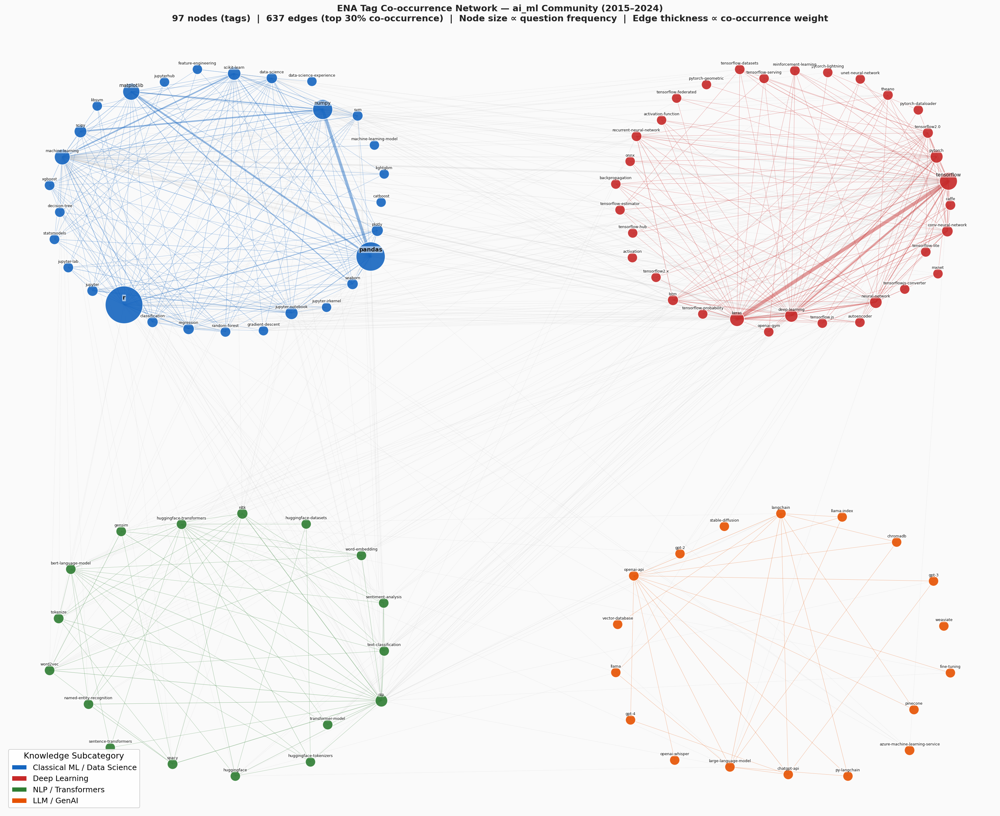
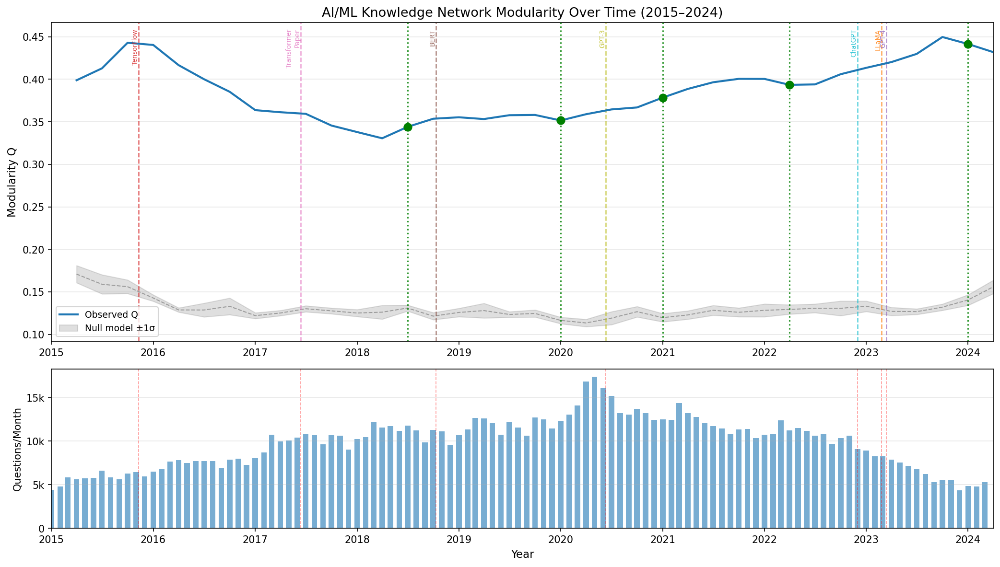
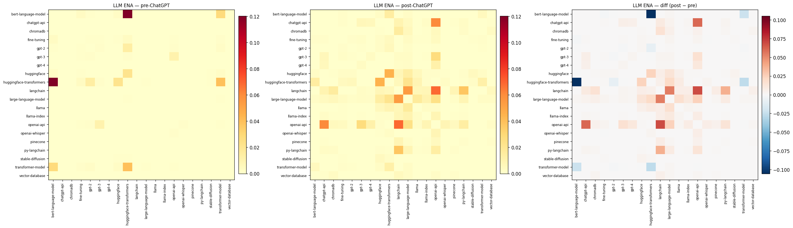

# Stack Overflow 技術社群知識結構分析

[](https://www.python.org/)
[](LICENSE)
[](https://archive.org/details/stackexchange)
[](https://pola.rs/)
[](https://networkx.org/)

> 以 **SNA × ENA × DNA** 三維框架，分析 Stack Overflow 2015–2024 年五大技術社群的知識結構形成與演化——並量化 ChatGPT 發布對 AI/ML 社群的結構性衝擊。

---

## 核心發現

| | 發現 | 數字 |
|---|---|---|
| **RQ1** | Louvain 社群偵測與 SO 官方標籤分類的吻合程度 | **NMI = 0.72** |
| **RQ2** | ChatGPT 發布前後，LLM 子集知識結構相似度 | **cosine = 0.21** |
| **RQ3** | AI/ML 子社群數量從 2015 到 2024 年的變化 | **60 → 5 個** |

- **RQ1（SNA）**：技術社群的邊界在資料中真實存在。7,555 名使用者同時活躍於全部五個社群，是跨領域知識流通的關鍵橋接者。

- **RQ2（ENA）**：ChatGPT 發布（2022/11）後 16 個月內，LLM 子集的知識連結從學術導向（BERT × HuggingFace）幾乎完全重組為工程應用導向（LangChain × OpenAI API）。

- **RQ3（DNA）**：AI/ML 社群歷經三個結構演化階段：整合期（2015–2018）→ 分化期（2018–2022）→ **結晶期**（2022–2024）。模組度 Q 上升的同時子社群數量下降——這是新興技術社群走向成熟的典型路徑。

---

## 視覺成果

### ENA：ai_ml 標籤共現網路（2015–2024 全時段）

*97 個標籤作為節點（大小正比於問題出現頻率），依知識子社群四色上色。僅顯示前 30% 強連結邊。*

### DNA：AI/ML 社群模組度時序演化（含技術事件標注）

*37 個滑動窗口快照（6 個月視窗、3 個月步長），灰色帶為 null model 隨機基準。*

### ENA：LLM 子集知識重組（ChatGPT 前後對比）

*左：ChatGPT 前（以 BERT 為中心）。右：ChatGPT 後（以 LangChain / OpenAI API 為中心）。*

---

## 專案結構

```
.
├── src/                         # 所有分析腳本
│   ├── extract_subset.py        # 步驟 1：XML → Parquet（僅需執行一次）
│   ├── build_all_networks.py    # 步驟 2：Parquet → 網路 PKL
│   ├── sna_analysis.py          # 步驟 3：Louvain 社群偵測 + 中介中心性
│   ├── sna_finalize.py          # 步驟 4：橋接使用者分析
│   ├── sna_compile_summary.py   # 步驟 5：彙整 SNA 結果
│   ├── ena_analysis.py          # 步驟 6：ENA 矩陣建構與前後比較
│   ├── ena_network_viz.py       # 步驟 7：節點–邊共現網路圖
│   ├── dna_analysis.py          # 步驟 8：滑動視窗 DNA 分析
│   └── data_loader.py           # 共用資料載入工具
│
├── outputs/
│   ├── figures/                 # 所有圖表（PNG）
│   └── tables/                  # 分析結果（CSV、Markdown、NPY 矩陣）
│
├── data/                        # ← 不含於 Git（請見下方「資料重建步驟」）
│   ├── processed/               # questions.parquet、answers.parquet
│   └── networks/                # tag 共現網路、user–QA 網路（PKL）
│
├── docs/                        # 參考文獻（請見 Citation）
├── requirements.txt
├── LICENSE
└── README.md
```

---

## 快速開始

### 安裝相依套件

```bash
git clone https://github.com/Raymond-Chen-das/social-network-analysis.git
cd social-network-analysis
pip install -r requirements.txt
```

建議使用 **Python 3.13**。主要套件：

| 套件 | 用途 |
|---|---|
| `polars` | 高效能 DataFrame（1.2 GB Parquet 的斷言下推） |
| `networkx` | 圖建構與分析 |
| `python-louvain` | Louvain 社群偵測 |
| `scikit-learn` | PCA（ENA Analysis C 跨社群比較） |
| `matplotlib` | 所有圖表的繪製 |

---

### 資料重建步驟

原始資料**不包含於本 Repository**（96.8 GB）。如需完整重現分析，請依下列步驟操作：

**步驟 1 — 下載 Stack Exchange Data Dump**

前往 [archive.org/details/stackexchange](https://archive.org/details/stackexchange)，
下載 `stackoverflow.com-Posts.7z`，解壓縮後將 `Posts.xml` 放置於專案根目錄。

**步驟 2 — 萃取五個技術社群的資料**

```bash
python src/extract_subset.py
# 輸出：data/processed/questions.parquet（約 1.2 GB）
#       data/processed/answers.parquet  （約 600 MB）
# 執行時間：約 45 分鐘
```

**步驟 3 — 建構共現網路與使用者問答網路**

```bash
python src/build_all_networks.py
# 輸出：data/networks/*.pkl
# 執行時間：約 20 分鐘
```

> **注意：** 步驟 2 和 3 只需執行一次。後續所有分析腳本均直接讀取 `data/processed/` 和 `data/networks/`。

---

## 執行分析

各步驟彼此獨立，依序執行即可。所有輸出寫入 `outputs/`。

```bash
# Phase 3 — SNA（Louvain 社群偵測 + Betweenness Centrality）
python src/sna_analysis.py          # 約 130 分鐘（中介中心性計算量大）
python src/sna_finalize.py
python src/sna_compile_summary.py   # → outputs/tables/sna_summary.md

# Phase 4 — ENA（知識結構矩陣比較）
python src/ena_analysis.py          # 約 5 分鐘
python src/ena_network_viz.py       # 約 10 分鐘（Spring layout）

# Phase 5 — DNA（滑動視窗模組度追蹤）
python src/dna_analysis.py          # 約 31 秒
```

所有涉及隨機性的操作均固定 `random_state=42`，確保完整可重現性。

---

## 分析結果摘要

### SNA（Phase 3）

| 社群 | 節點數 | 邊數 | Louvain Q | 社群數 | NMI |
|---|---:|---:|---:|---:|---:|
| `ai_ml` | 6,879 | 60,462 | 0.346 | 5 | 0.209 |
| `web_frontend` | 17,121 | 184,111 | 0.259 | 8 | 0.203 |
| `mobile` | 14,711 | 159,879 | 0.422 | 14 | 0.426 |
| `cloud_devops` | 8,108 | 70,846 | 0.482 | 9 | 0.356 |
| `databases` | 9,925 | 91,234 | 0.362 | 9 | 0.406 |
| `global` | 44,324 | 630,505 | 0.512 | 71 | **0.719** |

完整結果：[`outputs/tables/sna_summary.md`](outputs/tables/sna_summary.md)

### ENA（Phase 4）

| 分析 | 範圍 | Cosine Similarity | 詮釋 |
|---|---|---:|---|
| A | ai_ml（97 個標籤，全時段） | 0.906 | 整體結構穩定 |
| B | LLM 子集（20 個標籤，前後比較） | **0.209** | 知識結構接近完全重組 |
| C | 跨社群（5 個社群，PCA 投影） | 0.005–0.075 | 各社群 tag 詞彙幾乎不重疊 |

完整結果：[`outputs/tables/ena_summary.md`](outputs/tables/ena_summary.md)

### DNA（Phase 5）

| 階段 | 時期 | 模組度 Q | 子社群數 |
|---|---|---|---|
| 整合期 | 2015–2018 | 0.44 → 0.33 | ~60 |
| 分化期 | 2018–2022 | 0.33 → 0.40 | 逐步整合 |
| 結晶期 | 2022–2024 | 0.40 → **0.45** | **5** |

偵測到 5 個結構性斷點：2018-04、2019-10、2020-10、2022-01（低可信度）、2023-10。
所有時間窗口的 null model z-score > 22（社群結構非隨機雜訊）。

完整結果：[`outputs/tables/dna_summary.md`](outputs/tables/dna_summary.md)

---

## 技術架構

| 層次 | 工具 |
|---|---|
| 資料工程 | 串流 XML 解析（96.8 GB → 1.8 GB Parquet ETL）、`polars` predicate pushdown、`pyarrow` |
| 圖分析 | `networkx`、`python-louvain`、`scipy` |
| 機器學習 | `scikit-learn`（PCA） |
| 視覺化 | `matplotlib`（Community Bubble Layout 自製版面） |
| 統計驗證 | Configuration Model null model（Maslov–Sneppen rewiring，N=20） |

---

## 已知限制

1. NMI 驗證僅涵蓋全域圖中約 2% 的有標記節點，不反映整張圖的社群結構。
2. 橋接使用者寬鬆定義（min_weight=1）計算出 483,690 人；同時活躍於全部 5 個社群者為 7,555 人，後者更具分析意義。
3. ENA 跨社群相似度（0.005–0.075）反映的是各社群 tag 詞彙不重疊，而非內部拓撲結構差異。
4. 2022-01 DNA 斷點比 ChatGPT 早 10 個月，因果歸因為低可信度。
5. Stack Overflow 資料偏向英語母語的專業開發者，不代表全體軟體從業者。

---

## 引用

若您使用本專案的程式碼或分析結果，請引用：

```
Raymond Chen (2026). Stack Overflow Community Network Analysis:
Mapping Knowledge Structure Evolution with SNA, ENA, and DNA.
GitHub: https://github.com/Raymond-Chen-das/social-network-analysis
```

本研究延伸自：

> Moutidis, I., & Williams, H. T. P. (2021). Community evolution on Stack Overflow.
> *PLOS ONE*, 16(6), e0253010. https://doi.org/10.1371/journal.pone.0253010

---

## 授權

[MIT](LICENSE) © 2026 Raymond-Chen-das
